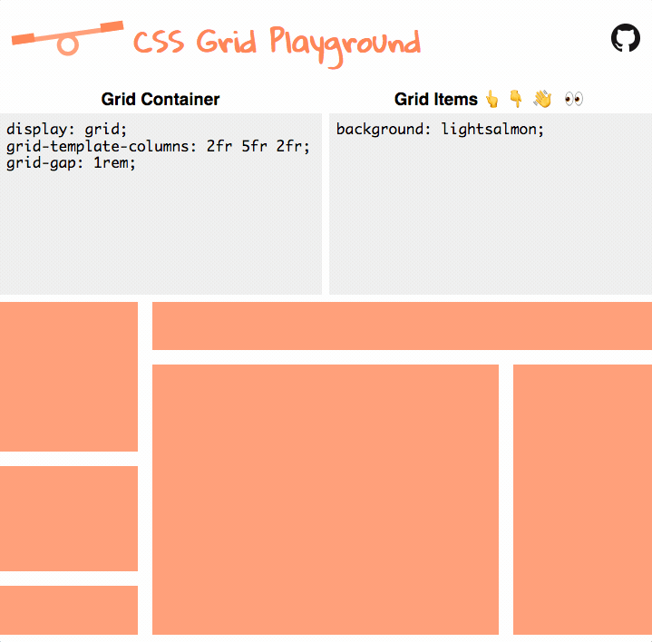

# CSS Grid Playground 

CSS Grid Playground lets you visually play with _Grid Container_ and _Grid Item_ elements in the browser to quickly sketch up a layout for your site. The layout changes instantly as you update the corresponding CSS giving you instant feedback.

## Background
[CSS Grid Layout](https://www.w3.org/TR/css3-grid-layout/) is fast becoming the best way to design modern website layouts. I knew I wanted to learn more about this new framework and it just so happened that General Assembly was hosting a [workshop](https://generalassemb.ly/education/how-css-grid-is-reinventing-webpage-design) with [@jensimmons](https://twitter.com/jensimmons) in NYC. The workshop was awesome and very informative.

It inspired me to create this tool that allows you to directly play with the new `grid` properties on the Grid Container or the Grid Items and see how they alter the grid structure. It helps me to learn CSS Grid better by being visual and responsive to CSS changes.

## Technologies Used
- CSS Grid Layouts
- create-react-app
- styled-components
- zeit.co/now
